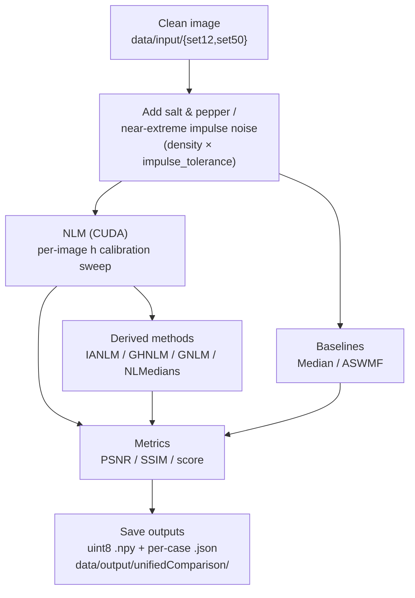

# SaltAndPepper — Impulse-Tolerant Non-Local Means Denoising

Reproducible **salt & pepper / near-extreme impulse** denoising experiments with
**RAPIDS + CuPy** (GPU) and **NumPy / scikit-image** (CPU).

This repository accompanies the manuscript submitted to
**Signal, Image and Video Processing (SIViP)** — Springer Nature.

The experiment is the unified comparison in
[`src/salt_experiments/unified_comparison/`](src/salt_experiments/unified_comparison).
It is **fully self-contained**: every filter, noise model and helper it needs lives
in that package's `lib/` folder, and it reads the clean reference images directly
from `data/input/`. You reproduce everything **from scratch** — no pre-computed data
is required. It runs one matched, resumable protocol across both datasets, all noise
densities, and both impulse tolerances, comparing seven methods:

`nlm`, `ianlm`, `median`, `aswmf`, `nlmedians`, `ghnlm`, `gnlm`

> **Note on datasets:** *Set12* here contains **11 images** (`n=11`); *Set50*
> contains **50 images** (`n=50`).

The environment is fully **reproducible**, frozen via:

- `conda-spec-linux-64.txt` → **explicit Conda lockfile**
- `requirements-pip.txt` → pip-only dependencies

No package solving occurs during container build.

---

## Requirements

- **Docker**
- **NVIDIA GPU** + CUDA **12.2**-compatible drivers (required for the CUDA NLM backend)
- **VS Code** + **Dev Containers** extension

> **Windows Tip:**
> Use **WSL2 (Ubuntu)** and open the repository from the **WSL filesystem**
> (avoid paths like `\\wsl.localhost\...` — they cause permission and performance issues).

## Recommended Setup on Windows (WSL2 + Docker Desktop)

To avoid errors and ensure GPU detection:

### Install and configure WSL2
Install **Ubuntu** from Microsoft Store.
Set WSL2 as default:

```powershell
wsl --set-default-version 2
```

### Configure Docker Desktop

Open Docker Desktop → go to:

⚙️ Settings → General

✔️ Enable "Use the WSL 2 based engine"

⚙️ Settings → Resources → WSL Integration

✔️ Enable your Linux distro (e.g., Ubuntu 22.04)

✔️ Keep checked: "Enable integration with additional distros"

Click Apply & Restart.

### Quick Start (VS Code + Dev Containers)

1. Open this folder in VS Code (inside WSL2).
2. Press **Ctrl+Shift+P → Dev Containers: Rebuild and Reopen in Container**
3. This will:
   - Build the full Docker environment
   - Restore the Conda env via `conda-spec-linux-64.txt`
   - Install pip packages from `requirements-pip.txt`

### Sanity check

```bash
python - << 'PY'
import cupy as cp, numpy as np, skimage
print("GPUs detected:", cp.cuda.runtime.getDeviceCount())
print("skimage:", skimage.__version__)
PY
```

## Quick Start (Docker CLI)

```bash
# Build image
docker build -t salt-frozen .devcontainer

# Open container
docker run --gpus=all --shm-size=4g -it --rm \
    -v "$PWD":/workspace -w /workspace salt-frozen bash
```

---

## Repository Layout

```
SaltAndPepper/
├─ .devcontainer/                 # VS Code / Docker container settings
│  ├─ Dockerfile
│  ├─ devcontainer.json
│  ├─ conda-spec-linux-64.txt     # Frozen Conda environment (explicit lockfile)
│  └─ requirements-pip.txt        # Extra pip-only dependencies
│
├─ data/
│  ├─ input/
│  │  ├─ set12/                   # Set12 benchmark (11 images: 01.png .. 11.png)
│  │  └─ set50/                   # 50-image dataset (0 .. 49)
│  └─ output/
│     └─ unifiedComparison/       # results are written here (starts empty)
│
├─ src/
│  └─ salt_experiments/
│     └─ unified_comparison/      # the canonical experiment — self-contained
│        ├─ run.py                # matched, resumable protocol (run this)
│        ├─ run_sequence.py       # two-phase resumable orchestration
│        └─ lib/                  # all filters, noise model and helpers
│           ├─ nlm_functions.py         # NLM: mirror padding + CUDA/CPU backends
│           ├─ anlm_functions.py        # IANLM (impulse-aware NLM)
│           ├─ geonlm_functions.py      # GNLM (graph/KNN NLM)
│           ├─ geonlm_medians_functions.py  # GHNLM + shared robust helpers
│           ├─ nlmedians.py             # NLMedians
│           ├─ salt_filters.py          # ASWMF
│           ├─ impulse_tolerance_filters.py  # tolerance-aware entry points
│           └─ noisy_functions.py       # salt & pepper / near-extreme impulse noise
│
└─ README.md
```

## Legacy material

Earlier per-level experiments, exploratory parameter studies, notebooks, plots,
and their historical outputs live in [`legacy/`](legacy/). They are retained for
provenance only and are not interchangeable with the canonical protocol. The
article cites the canonical runner and the archived final records in
`data/output/unifiedComparisonFinal/`; use `unified_comparison/` for a new run.

---

## Running the Experiment

All experiments run **inside the container**. The comparison is a single matched
protocol; it is **resumable** and **idempotent** — each completed `{method}.json`
is a completion marker, so re-running skips finished work.

The scripts resolve their own paths and imports, so run them **directly** from the
repository root (no `PYTHONPATH` needed).

### 1. Test run first (recommended)

Before the full run, verify your GPU and environment on a single image. This
completes in a few minutes and writes to a throwaway directory:

```bash
python src/salt_experiments/unified_comparison/run.py \
    --datasets set12 --levels low --tolerances 0 \
    --max-images 1 --output data/output/test_run
```

If it prints `DONE` lines for each method and writes `summary_partial.csv`, your
setup is good.

### 2. Full run

Both datasets, all densities, both tolerances, all methods. Results are written to
the empty `data/output/unifiedComparison/` directory:

```bash
python src/salt_experiments/unified_comparison/run.py
```

Scope the run with CLI flags:

```bash
# Only Set12, only the 'low' and 'high' densities, tolerance 0, IANLM vs GHNLM
python src/salt_experiments/unified_comparison/run.py \
    --datasets set12 --levels low high --tolerances 0 \
    --methods ianlm ghnlm
```

Available options:

| Flag | Values | Default |
|------|--------|---------|
| `--datasets` | `set12`, `set50` | both |
| `--levels`   | `low`, `moderate`, `medium`, `high`, `extreme` | all |
| `--tolerances` | `0`, `4` | both |
| `--methods`  | `nlm`, `ianlm`, `median`, `aswmf`, `nlmedians`, `ghnlm`, `gnlm` | all |
| `--max-images` | positive integer | all images |
| `--output`   | path | `data/output/unifiedComparison` |

> `nlm` is always calibrated first because several methods derive their `h` from
> the current per-image NLM calibration.

### Orchestrated two-phase run

For long unattended runs, `run_sequence.py` executes the light methods first,
then the expensive `gnlm`, tracking progress in `batch_status.json`:

```bash
python src/salt_experiments/unified_comparison/run_sequence.py
```

### Targeted GNLM sensitivity pilot

To inspect the reported GNLM structure `(f, t, k) = (1, 3, 7)` before making
a broader claim, run the small Set12 medium-density pilot. It uses images
`01`, `06`, and `11`, both final tolerances, and four nearby alternatives;
it writes per-case records plus `results.csv` and `summary.csv`.

```bash
python src/salt_experiments/unified_comparison/studies/ablations/gnlm_structural_sensitivity.py
```

This is a descriptive pilot, not an optimization over all images, densities,
or tolerances. It retains only metadata, calibration curves, and tabular
results under `data/output/studies/ablations/`; inspect its planned workload
first with `--dry-run`.

### Noise densities and impulse tolerance

| Level | Density | | Tolerance | Meaning |
|-------|---------|-|-----------|---------|
| low | 1% | | `0` | impulses are exactly 0 / 255 |
| moderate | 3% | | `4` | near-extreme impulses (values within 4 of 0 or 255) |
| medium | 5% | | | |
| high | 10% | | | |
| extreme | 20% | | | |

Selection metric used throughout: **score = 0.5·PSNR + 50·SSIM** (uint8, `data_range=255`).

---

## Results

Your run writes everything to **`data/output/unifiedComparison/`**:

- `protocol.json` — the exact, versioned protocol used (all hyperparameters).
- `summary_partial.csv` — aggregated PSNR / SSIM / score / runtime, grouped by
  `dataset, tolerance, level, method`.
- `results_partial.csv` — one row per (image, method) with full metadata.
- `set12/`, `set50/` — per-case artifacts under
  `<dataset>/tolerance_<τ>/<level>/<image>/`:
  - `case.json` (SHA-256 identity of reference + noisy),
  - `noisy.npy`, `corruption_mask.npy`, `detector.json`,
  - `<method>.npy` (denoised uint8) and `<method>.json` (metrics + params),
  - `nlm_h_sweep.csv` (per-image NLM calibration curve).

### Headline findings (mean score)

- **IANLM and GHNLM lead** in essentially every condition, virtually tied on
  PSNR/SSIM — but **IANLM is ~30–100× faster** than GHNLM for equivalent quality.
- **ASWMF** is the fastest overall and solid at tolerance `0`, but **collapses at
  tolerance `4`** (it depends on impulses sitting at exact 0/255).
- **Median** is a stable, cheap baseline; **GNLM / NLMedians / plain NLM** trail.

The `summarize()` step in `run.py` rewrites `results_partial.csv` and
`summary_partial.csv` from the completed per-case `*.json` records after every
image and at the end of a run, so re-running the experiment (which skips finished
work) also refreshes the summaries safely.

---

## Data

The experiment reads the clean reference images directly from `data/input/` and
generates the noisy versions on the fly (fixed seed = 42). Nothing else is needed.

- `data/input/set12/` — **Set12** benchmark, **11 images** (`01.png` .. `11.png`).
- `data/input/set50/` — **50-image** dataset (`0` .. `49`).

Images are loaded as grayscale and cast to `float32` in `[0,255]`. The per-case
`case.json` records SHA-256 hashes of both the reference and the noisy array, so
identity is verifiable.

---

## Experiment Pipeline (Flowchart)



---

## Reproducibility & Environment

This project is fully reproducible because:

- A frozen explicit spec is used:
  `conda list --explicit --md5 > conda-spec-linux-64.txt`
- Pip requirements are isolated (`requirements-pip.txt` holds only packages not
  available via Conda).
- The Dockerfile pins the CUDA 12.2 RAPIDS base and fixed dependencies.

Protocol integrity is enforced at runtime: `run.py` writes `protocol.json` and
**aborts** if an existing output directory contains a different protocol, and it
verifies per-case SHA-256 identity, so an output folder always corresponds to
exactly one protocol.

**Updating the environment** (inside the container):

```bash
conda list --explicit --md5 > conda-spec-linux-64.txt
```

Avoid adding Conda-managed packages to `requirements-pip.txt`.

---

## Input Images (Git LFS)

The input images under `data/input/` are tracked with Git LFS. After cloning,
fetch them before running:

```bash
git lfs install
git lfs pull
```

---

## Troubleshooting

**❌ GPU not found inside container**

```bash
nvidia-smi                       # check host GPU
```
Then: Docker Desktop → WSL Integration → enable your distro, and inside the container:

```bash
python - << 'PY'
import cupy as cp
print(cp.cuda.runtime.getDeviceCount())
PY
```

**❌ Permission denied when writing outputs**

Keep the project inside `/home/<user>/...`, **not** inside `/mnt/c/Users/...`.

**❌ "Different protocol in output directory"**

The target `--output` folder was created with a different `protocol.json`.
Use a new directory (or reuse the matching one) — this guard prevents mixing
incompatible runs.

**❌ Container slow because it is solving Conda dependencies**

This repo avoids solving by using an explicit spec. To change packages: modify the
environment inside the container, then re-export the lockfile.

---

## License

License: [MIT](./LICENSE)
SPDX-Identifier: `MIT`
