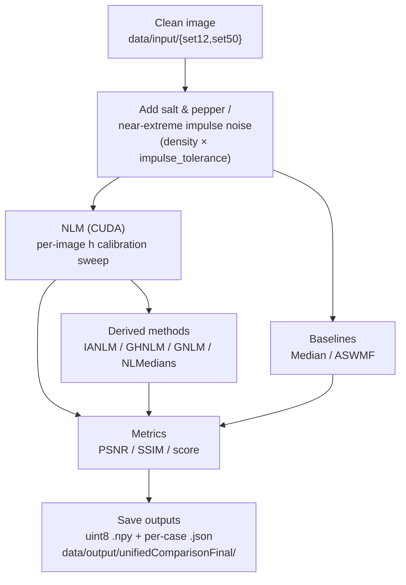

# SaltAndPepper — Impulse-Tolerant Non-Local Means Denoising

Reproducible **salt & pepper / near-extreme impulse** denoising experiments with
**RAPIDS + CuPy** (GPU) and **NumPy / scikit-image** (CPU).

This repository accompanies the manuscript submitted to
**Signal, Image and Video Processing (SIViP)** — Springer Nature.

The **canonical, final experiment** is the unified comparison in
[`src/salt_experiments/unified_comparison/`](src/salt_experiments/unified_comparison).
It runs one matched, resumable protocol across both datasets, all noise densities,
and both impulse tolerances, comparing seven methods:

`nlm`, `ianlm`, `median`, `aswmf`, `nlmedians`, `ghnlm`, `gnlm`

All earlier scripts (per-level `Salt_*`/`main_*`, hybrid runs, sweeps, timing studies)
are kept as **legacy / exploratory** material — see [Legacy material](#legacy--exploratory-material).

> **Note on datasets:** *Set12* here contains **11 images**. The *Lena* image was
> removed because its use is restricted (it was disallowed in our previous IEEE Access
> submission). All results in `data/output/unifiedComparisonFinal/` reflect this
> (`n=11` for Set12, `n=50` for Set50).

The environment is fully **reproducible**, frozen via:

- `conda-spec-linux-64.txt` → **explicit Conda lockfile**
- `requirements-pip.txt` → pip-only dependencies

No package solving occurs during container build.

---

## Requirements

- **Docker**
- **NVIDIA GPU** + CUDA **12.2**-compatible drivers (required for the CUDA NLM backend)
- **VS Code** + **Dev Containers** extension

> **Windows Tip:**
> Use **WSL2 (Ubuntu)** and open the repository from the **WSL filesystem**
> (avoid paths like `\\wsl.localhost\...` — they cause permission and performance issues).

## Recommended Setup on Windows (WSL2 + Docker Desktop)

To avoid errors and ensure GPU detection:

### Install and configure WSL2
Install **Ubuntu** from Microsoft Store.
Set WSL2 as default:

```powershell
wsl --set-default-version 2
```

### Configure Docker Desktop

Open Docker Desktop → go to:

⚙️ Settings → General

✔️ Enable "Use the WSL 2 based engine"

⚙️ Settings → Resources → WSL Integration

✔️ Enable your Linux distro (e.g., Ubuntu 22.04)

✔️ Keep checked: "Enable integration with additional distros"

Click Apply & Restart.

### Quick Start (VS Code + Dev Containers)

1. Open this folder in VS Code (inside WSL2).
2. Press **Ctrl+Shift+P → Dev Containers: Rebuild and Reopen in Container**
3. This will:
   - Build the full Docker environment
   - Restore the Conda env via `conda-spec-linux-64.txt`
   - Install pip packages from `requirements-pip.txt`

### Sanity check

```bash
python - << 'PY'
import cupy as cp, numpy as np, skimage
print("GPUs detected:", cp.cuda.runtime.getDeviceCount())
print("skimage:", skimage.__version__)
PY
```

## Quick Start (Docker CLI)

```bash
# Build image
docker build -t salt-frozen .devcontainer

# Open container
docker run --gpus=all --shm-size=4g -it --rm \
    -v "$PWD":/workspace -w /workspace salt-frozen bash
```

---

## Repository Layout

```
SaltAndPepper/
├─ .devcontainer/                 # VS Code / Docker container settings
│  ├─ Dockerfile
│  ├─ devcontainer.json
│  ├─ conda-spec-linux-64.txt     # Frozen Conda environment (explicit lockfile)
│  └─ requirements-pip.txt        # Extra pip-only dependencies
│
├─ data/
│  ├─ input/
│  │  ├─ set12/                   # Set12 benchmark (11 images; Lena removed)
│  │  └─ set50/                   # 50-image dataset
│  └─ output/
│     ├─ unifiedComparisonFinal/  # >>> FINAL results (the canonical experiment) <<<
│     └─ ...                      # legacy / exploratory outputs (see below)
│
├─ src/
│  └─ salt_experiments/
│     ├─ unified_comparison/      # >>> FINAL experiment (run here) <<<
│     │  ├─ run.py                # Matched, resumable protocol
│     │  └─ run_sequence.py       # Two-phase resumable orchestration
│     ├─ functions/               # Shared filter implementations (NLM, IANLM, GHNLM, ...)
│     ├─ metrics/                 # Plotting notebooks and table generators
│     └─ (legacy)                 # set12/, set50/, *_hibrid/, *_impulse_tolerance/, compact_*
│
└─ README.md
```

---

## Running the Final Experiment (unified_comparison)

All experiments run **inside the container**. The final comparison is a single
matched protocol; it is **resumable** and **idempotent** — each completed
`{method}.json` is a completion marker, so re-running skips finished work.

The scripts resolve their own paths and imports, so run them **directly** from the
repository root (no `PYTHONPATH` needed).

Full run (both datasets, all levels, both tolerances, all methods):

```bash
python src/salt_experiments/unified_comparison/run.py
```

Scope the run with CLI flags:

```bash
# Only Set12, only the 'low' and 'high' densities, tolerance 0, IANLM vs GHNLM
python src/salt_experiments/unified_comparison/run.py \
    --datasets set12 --levels low high --tolerances 0 \
    --methods ianlm ghnlm

# Quick smoke test: first image only, into a scratch directory
python src/salt_experiments/unified_comparison/run.py \
    --max-images 1 --output data/output/scratch
```

Available options:

| Flag | Values | Default |
|------|--------|---------|
| `--datasets` | `set12`, `set50` | both |
| `--levels`   | `low`, `moderate`, `medium`, `high`, `extreme` | all |
| `--tolerances` | `0`, `4` | both |
| `--methods`  | `nlm`, `ianlm`, `median`, `aswmf`, `nlmedians`, `ghnlm`, `gnlm` | all |
| `--max-images` | positive integer | all images |
| `--output`   | path | `data/output/unifiedComparisonV1` |

> `nlm` is always calibrated first because several methods derive their `h`
> from the current NLM calibration (never from a legacy pickle).

### Orchestrated two-phase run

For long unattended runs, `run_sequence.py` executes the light methods first,
then the expensive `gnlm`, tracking progress in `batch_status.json`:

```bash
python src/salt_experiments/unified_comparison/run_sequence.py
```

### Noise densities and impulse tolerance

| Level | Density | | Tolerance | Meaning |
|-------|---------|-|-----------|---------|
| low | 1% | | `0` | impulses are exactly 0 / 255 |
| moderate | 3% | | `4` | near-extreme impulses (values within 4 of 0 or 255) |
| medium | 5% | | | |
| high | 10% | | | |
| extreme | 20% | | | |

Selection metric used throughout: **score = 0.5·PSNR + 50·SSIM** (uint8, `data_range=255`).

---

## Results

Final results live in **`data/output/unifiedComparisonFinal/`**:

- `protocol.json` — the exact, versioned protocol used (all hyperparameters).
- `summary_partial.csv` — aggregated PSNR / SSIM / score / runtime, grouped by
  `dataset, tolerance, level, method`.
- `results_partial.csv` — one row per (image, method) with full metadata.
- `set12/`, `set50/` — per-case artifacts under
  `<dataset>/tolerance_<τ>/<level>/<image>/`:
  - `case.json` (SHA-256 identity of reference + noisy),
  - `noisy.npy`, `corruption_mask.npy`, `detector.json`,
  - `<method>.npy` (denoised uint8) and `<method>.json` (metrics + params),
  - `nlm_h_sweep.csv` (per-image NLM calibration curve).

### Headline findings (mean score)

- **IANLM and GHNLM lead** in essentially every condition, virtually tied on
  PSNR/SSIM — but **IANLM is ~30–100× faster** than GHNLM for equivalent quality.
- **ASWMF** is the fastest overall and solid at tolerance `0`, but **collapses at
  tolerance `4`** (it depends on impulses sitting at exact 0/255).
- **Median** is a stable, cheap baseline; **GNLM / NLMedians / plain NLM** trail.

The `summarize()` step in `run.py` rewrites `results_partial.csv` and
`summary_partial.csv` from the completed per-case `*.json` records after every
image and at the end of a run, so re-running the experiment (which skips finished
work) also refreshes the summaries safely.

---

## Data

Input images used by the experiments:

- `data/input/set12/` — **Set12** benchmark, **11 images** (Lena removed for licensing).
- `data/input/set50/` — **50-image** dataset.

Clean references consumed by `unified_comparison` come from the legacy NLM pickles at
`data/output/<dataset>/salt_pepper_<level>/full_512/results/array_nlm_salt_pepper_<level>_filtereds.pkl`.
These legacy outputs must remain in place for the final run to reproduce.

---

## Figures, Crops and Tables (previously used)

Visual and tabular artifacts produced for the analysis:

- `data/output/crop_previews/`, `data/output/crops_extreme_regions/`,
  `data/output/crops_extreme_regions_150_450/` — zoomed crops for qualitative figures.
- `data/output/selected_noisy_images/` — chosen noisy examples for figures.
- `data/output/ianlm_vs_ghnlm/`, `data/output/ianlm_timing/` — IANLM vs GHNLM
  comparison and runtime study.
- `data/output/hibrid_runtime_tables/`, `data/output/hibrid_statistical_tables/` —
  runtime and statistical tables.

Plotting notebooks and table generators are under `src/salt_experiments/metrics/`:

Run these directly from the repository root (they resolve their own imports; some
write to `/workspace/data/output/...`, i.e. they expect the container mount):

```bash
# Runtime tables
python src/salt_experiments/metrics/create_runtime_tables.py

# IANLM vs GHNLM comparison
python src/salt_experiments/metrics/create_ianlm_vs_ghnlm_comparison.py

# Statistical tables
python src/salt_experiments/metrics/create_hibrid_statistical_tables.py
```

The `*.ipynb` notebooks (`graphs_results_*.ipynb`, `best_results_PSNR_SSSIM_GEO.ipynb`)
open directly in VS Code / Jupyter inside the container.

---

## Experiment Pipeline (Flowchart)



---

## Reproducibility & Environment

This project is fully reproducible because:

- A frozen explicit spec is used:
  `conda list --explicit --md5 > conda-spec-linux-64.txt`
- Pip requirements are isolated (`requirements-pip.txt` holds only packages not
  available via Conda).
- The Dockerfile pins the CUDA 12.2 RAPIDS base and fixed dependencies.

Protocol integrity is enforced at runtime: `run.py` writes `protocol.json` and
**aborts** if an existing output directory contains a different protocol, and it
verifies per-case SHA-256 identity, so an output folder always corresponds to
exactly one protocol.

**Updating the environment** (inside the container):

```bash
conda list --explicit --md5 > conda-spec-linux-64.txt
```

Avoid adding Conda-managed packages to `requirements-pip.txt`.

---

## Legacy / Exploratory material

Kept for provenance and reproducibility of intermediate studies. **Not** part of
the final protocol, but some (the `salt_pepper_*` pickles) are still consumed by
`unified_comparison` as clean references, so do not delete them.

Source (`src/salt_experiments/`):

- `set12/`, `set50/` — per-level `main_*` / `Salt_*` scripts and parameter sweeps.
- `set12_hibrid/`, `set50_hibrid/` — hybrid (ASWMF + NLM) runs and ablations.
- `set12_impulse_tolerance/`, `set50_impulse_tolerance/` — impulse-tolerance studies.
- `compact_nlm_sweep/`, `compact_nlm_ghnlm/` — compact NLM range sweeps.
- `measure_ianlm_hibrid_times.py` — timing measurements.

Outputs (`data/output/`): `set12/`, `set50/`, `set12Hibrid/`, `set50Hibrid/`,
`set12ImpulseTolerance*/`, `set50ImpulseToleranceH1/`, `compactNLMRange*/`.

---

## Data & Outputs (Git LFS)

Large experiment outputs can bloat the repo. Use Git LFS if needed:

```bash
git lfs install
echo "data/** filter=lfs diff=lfs merge=lfs -text" >> .gitattributes
```

---

## Troubleshooting

**❌ GPU not found inside container**

```bash
nvidia-smi                       # check host GPU
```
Then: Docker Desktop → WSL Integration → enable your distro, and inside the container:

```bash
python - << 'PY'
import cupy as cp
print(cp.cuda.runtime.getDeviceCount())
PY
```

**❌ Permission denied when writing outputs**

Keep the project inside `/home/<user>/...`, **not** inside `/mnt/c/Users/...`.

**❌ "Different protocol in output directory"**

The target `--output` folder was created with a different `protocol.json`.
Use a new directory (or reuse the matching one) — this guard prevents mixing
incompatible runs.

**❌ Container slow because it is solving Conda dependencies**

This repo avoids solving by using an explicit spec. To change packages: modify the
environment inside the container, then re-export the lockfile.

---

## License

License: [MIT](./LICENSE)
SPDX-Identifier: `MIT`
